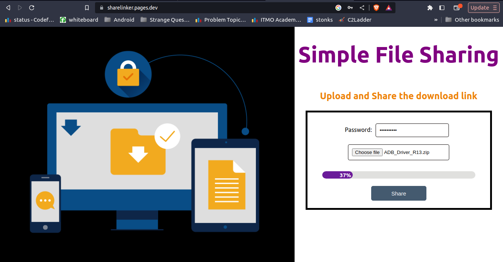
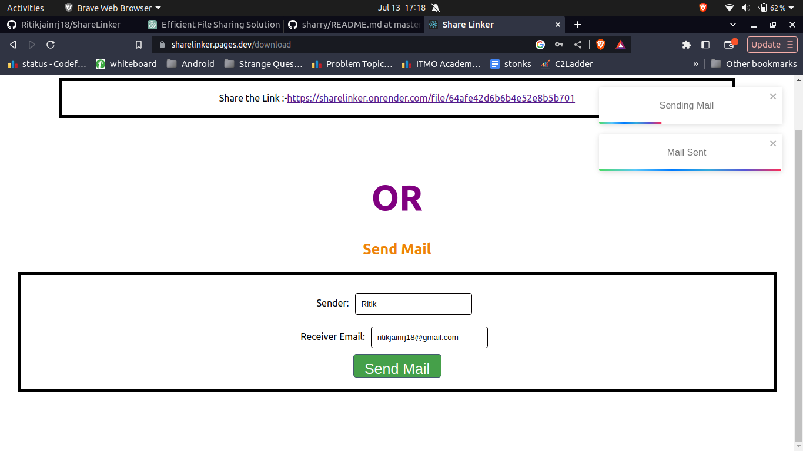
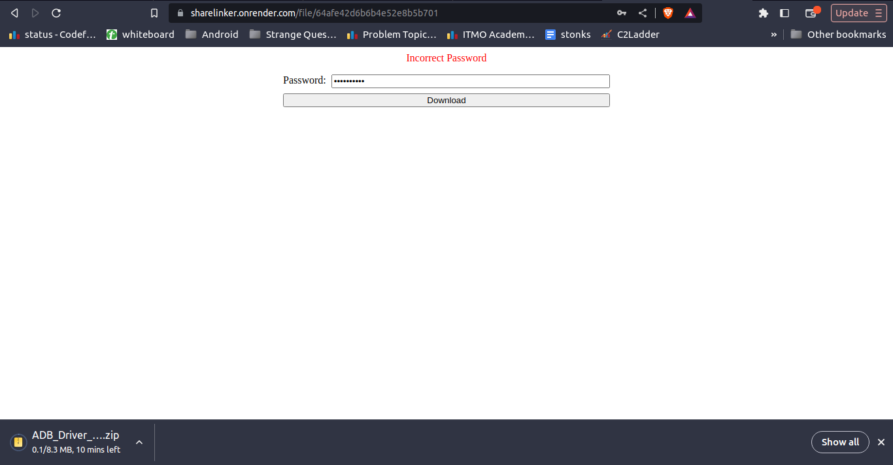

# ShareLinker

Sharelinker allows users to upload files and add password protection, if desired. This generates a URL that users can directly copy and share with friends or send via email through the application. Using this URL, friends can securely download the file.

## Tech Stack Used

### ReactJs

1) Virtual DOM: ReactJS utilizes a virtual DOM (Document Object Model) to efficiently update and render user interfaces. By maintaining a lightweight representation of the actual DOM in memory, React can perform efficient updates and minimize unnecessary re-renders. This results in improved performance and a smoother user experience.
2) Rich Ecosystem and Community Support: ReactJS has a vibrant and active community with extensive resources, libraries, and tools available. This ecosystem provides a wide range of solutions for common development challenges.

### ExpressJs & Nodejs

1) Single Language for Full Stack: Both Node.js and Express.js use JavaScript as their primary language. This allowed to use the same language on both the frontend and backend.

2) Speed and Performance: Node.js, the runtime on which Express.js is built, is based on a non-blocking architecture. This design allows it to handle a large number of concurrent connections efficiently, making it a good choice for this applications.

3) Vibrant Ecosystem: The Node.js and Express.js ecosystems have grown significantly, with a wealth of open-source libraries and modules available via npm (Node Package Manager). This large selection of pre-built components makes development faster and easier.
<!-- that require high scalability and performance. -->

### MongoDB

MongoDB, a popular NoSQL database, offers several advantages for backend development:

1) Flexible Data Model: MongoDB uses a flexible, document-based data model called BSON (Binary JSON).
BSON is a binary-encoded format and is compact for transmitting over a network. This schema-less nature of MongoDB allows for easy modifications to the data model.

2) Scalability and Performance: MongoDB is designed to scale horizontally across multiple servers, allowing user to handle large amounts of data and high traffic loads. Additionally, MongoDB's query optimization and indexing mechanisms ensure efficient data retrieval, even for large datasets.

<!-- schema defined nahi tha aur relations nahi hai -->

### Cloudflare 

Hosted front end on Cloudflare. It offers certain advantages.

1) Content Delivery Network (CDN):A CDN is a geographically distributed group of servers that caches content close to end users this improves visitors experience faster page loading times. 
2) Easy Deployment and Continuous Integration: Cloudflare Pages offers seamless integration with popular version control systems such as GitHub. This allows for easy deployment of frontend updates through automated pipelines, ensuring a smooth and efficient development workflow.
3) Cost-effective Solution: Cloudflare Pages offers a generous free tier for hosting static websites and provides cost-effective pricing plans for higher traffic volumes.

### Render 

Hosted backend on Render.

1) High Availability: By distributing backend across multiple available zones, Render ensures that application remains highly available. 
2) Easy and free deployment.

## Screenshots

 

<!-- 

description of app
demo 
tech stack used 

problems
-> I was confused that whether i should store the file in server or to mongodb.
-> env file

Asynchronous Programming: Node.js and Express.js are designed to work well with asynchronous programming patterns, which can lead to more responsive and efficient applications. Asynchronous operations prevent the server from getting blocked while waiting for I/O operations to complete, enabling it to handle multiple requests simultaneously.

Vibrant Ecosystem: The Node.js and Express.js ecosystems have grown significantly, with a wealth of open-source libraries and modules available via npm (Node Package Manager). This large selection of pre-built components makes development faster and easier.
// study with alex video
// my application have lots of several request (less cpu work ) 
// other use blocking io with multi threads js uses non-blocking as emaphises on callback  
So, why non-blocking I/O is sometimes preferred over multithreading:

Scalability: Non-blocking I/O is generally more scalable when dealing with many short-lived connections, like in web servers or real-time applications. Creating and managing threads for each connection can be resource-intensive, leading to scalability issues when dealing with a large number of connections.

Memory Overhead: Creating and managing multiple threads can consume a significant amount of memory. Non-blocking I/O can reduce memory overhead as it does not require a separate thread for each connection.

Simplicity: Non-blocking I/O can be simpler to implement and reason about, especially in event-driven programming models. It eliminates the need to handle thread synchronization and potential concurrency issues.

Concurrency without Parallelism: In some cases, you may want to achieve concurrency without parallelism. Non-blocking I/O allows you to handle multiple tasks concurrently without utilizing multiple CPU cores. This can be useful when parallel execution is not necessary or not beneficial.

However, it's important to note that both non-blocking I/O and multithreading have their strengths and weaknesses
 -->