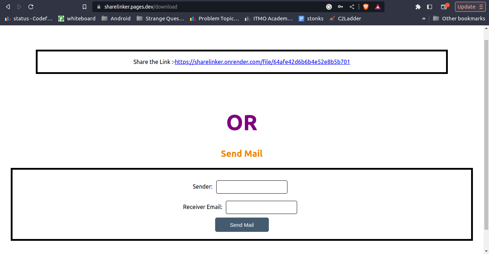
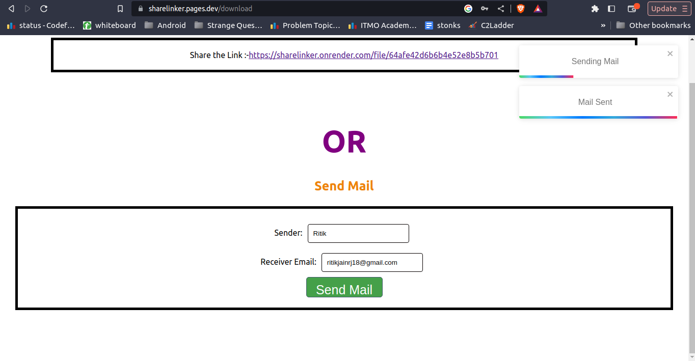

# ShareLinker

Sharelinker allows users to upload files and add password protection, if desired. This generates a URL that users can directly copy and share with friends or send via email through the application. Using this URL, friends can securely download the file.

## Tech Stack Used

### ReactJs

1) Virtual DOM: ReactJS utilizes a virtual DOM (Document Object Model) to efficiently update and render user interfaces. By maintaining a lightweight representation of the actual DOM in memory, React can perform efficient updates and minimize unnecessary re-renders. This results in improved performance and a smoother user experience.
2) Rich Ecosystem and Community Support: ReactJS has a vibrant and active community with extensive resources, libraries, and tools available. This ecosystem provides a wide range of solutions for common development challenges.

### ExpressJs & Nodejs

### MongoDB

MongoDB, a popular NoSQL database, offers several advantages for backend development:

1) Flexible Data Model: MongoDB uses a flexible, document-based data model called BSON (Binary JSON).
BSON is a binary-encoded format and is compact for transmitting over a network. This schema-less nature of MongoDB allows for easy modifications to the data model.
2) Scalability and Performance: MongoDB is designed to scale horizontally across multiple servers, allowing user to handle large amounts of data and high traffic loads. Additionally, MongoDB's query optimization and indexing mechanisms ensure efficient data retrieval, even for large datasets.

### Cloudflare 

Hosted front end on Cloudflare. It offers certain advantages.

1) Content Delivery Network (CDN):A CDN is a geographically distributed group of servers that caches content close to end users this improves visitors experience faster page loading times. 
2) Easy Deployment and Continuous Integration: Cloudflare Pages offers seamless integration with popular version control systems such as GitHub. This allows for easy deployment of frontend updates through automated pipelines, ensuring a smooth and efficient development workflow.
3) Cost-effective Solution: Cloudflare Pages offers a generous free tier for hosting static websites and provides cost-effective pricing plans for higher traffic volumes.

### Render 

Hosted backend on Render.

1) High Availability: By distributing backend across multiple available zones, Render ensures that application remains highly available. 
2) Easy and free deployment.

## Screenshots

 

